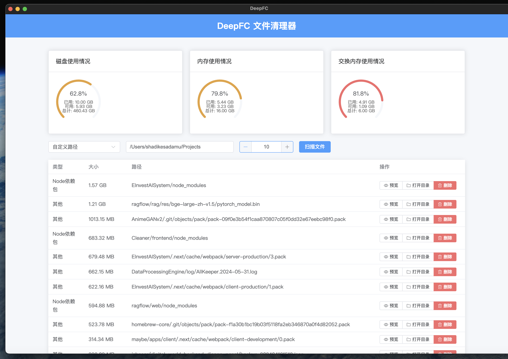
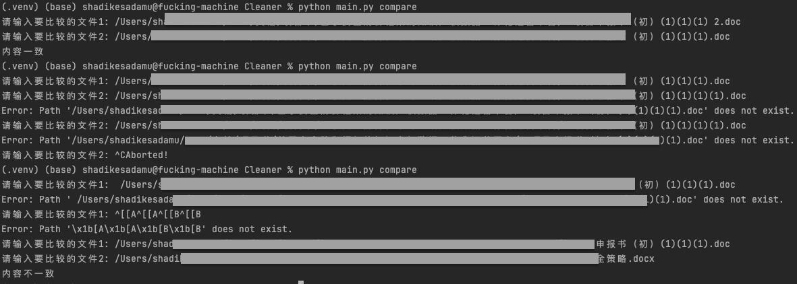

# DeepClean 🧹 深度扫描-文件清理工具

基于`Electron`+`Vue3`+`Vite`+`FastAPI` 开发的跨平台深度文件扫描清理工具.


## 核心功能

* 微信历史消息大附件扫描
* 系统级大文件扫描
* 用户级大文件扫描
* Python和Node等语言开发环境依赖包文件夹扫描
* AI 智能分析：对扫描出的文件/文件夹一键 AI 分析（数据来源、用途、删除风险评估、压缩/迁移建议），并支持基于分析的追问对话
* **macOS 应用深度卸载**：列出已安装应用（含版本/Bundle ID/体积/运行状态），**默认按体积降序**（表头可按名称/体积排序），搜索支持**显示名 / 多语言别名（InfoPlist.strings，如 Finder 中的中文名）/ Bundle ID**；按 Bundle ID 与应用名在 `~/Library`（含 Application Support 二级目录如 CrashReporter）、`/Library`、`/private/var/db/receipts`、`/private/var/folders/<x>/<y>/C|T`、`~/Downloads`、`/Users/Shared/PKGs` 中定位全部残留（偏好设置、缓存、应用数据、沙盒容器、群组容器、网络缓存、Cookie、日志、崩溃报告、启动项、特权助手、安装收据、应用下载数据、安装包、系统临时缓存、`~/.<AppName>` 隐藏配置），弹窗勾选确认后**移入废纸篓（默认）或永久删除**；卸载前可自动退出运行中的进程，支持 `pkgutil --forget` 忘记安装收据，系统目录自动提权。
    - 匹配分两层：**强关联**（Bundle ID/应用名边界匹配）默认勾选；**疑似关联**（如 `i4ToolsDownloads` 这类纯包含关键字的模糊命中）与用户数据/安装包分类**只列出、默认不勾选**，带「疑似关联/默认未选」标签由用户确认。弹窗汇总按**强关联/疑似分栏报数**（列表"大小"列仅为本体口径，弹窗内"本体 N · 强关联合计 · 疑似合计"分别列示），清单中强关联项排在疑似项之前。
    - 安全设计：每个删除目标经后端二次校验（必须位于允许的残留根之内 + 名称与应用边界匹配，模糊项仅限用户手动勾选且仍须在残留根内 + 符号链接解析后不得逃逸），任一目标不合法则**整体拒绝、一个文件都不删**；系统应用/永久删除需经「取消 / 强制执行」危险确认。

### AI 分析配置

AI 分析支持任何 **OpenAI 兼容接口**（火山方舟 Ark / OpenAI / DeepSeek / Ollama 等）。

方式一（推荐）：界面配置 —— 扫描列表点任意记录的「AI 分析」→ 弹窗右下角「AI 设置」，填写接口地址 / API Key / 模型后保存（配置持久化在 `backend/.env`，Key 不入库不上传）。

方式二：手动配置 —— 复制模板并填写：

```shell
cp backend/.env.example backend/.env
```

```ini
base_url=https://ark.cn-beijing.volces.com/api/v3
api_key=<你的Key>
model=<模型ID或推理接入点>
```

### AI 分析使用

1. 扫描完成后，在文件列表「操作」列点击 **AI 分析**
2. 弹窗内自动开始流式输出四段结构化分析：① 这个数据是怎么产生的 ② 用来干嘛的/有什么用 ③ 该不该删/能否压缩 ④ 处理建议
3. 分析完成后可在底部输入框继续追问（如「删掉之后需要时怎么恢复」），AI 基于分析上下文流式回复
4. 「重新分析」按钮可重跑；「AI 设置」可随时修改模型配置

> 注：AI 分析走后端转发到所配置的 LLM 接口，API Key 仅保存在本地 `backend/.env`；前端通过 `VITE_API_BASE`（默认同源/代理）访问后端，开发直连模式见 `frontend/.env.development`。


## 开发计划 & TODO

* [ ] 相册最大文件扫描器
    * 其实扫描 [此处](~/Pictures/Photos Library.photoslibrary/) 即可.
* [ ] 微信最大文件扫描器
    * 其实扫描[此处](~/Library/Containers/com.tencent.xinWeChat/Data)即可.
* [ ] 结合到[Immich的python上传脚本](https://immich.app/docs/guides/python-file-upload), 实现先上传到Immich, 然后进行删除
    * 当然是先要给用户一个选择(直接删除/备份再删除本地副本)
* [ ] 大文件扫描
  * [ ] 特殊文件包扫描
    * [X] Node环境依赖包(node_modules)
    * [ ] .next
    * [X] Python环境(.env)
    * [ ] ...
* [ ] ~~利用Tkinter先实现简单的可视化界面.~~
* [ ] ~~后期用WPF为Windows系统出一个更完美的UI和使用体验.~~
* [ ] ~~后期使用Swift给MacOS系统出一个更完美的UI和使用体验.~~
* [ ] 得好好研究一下`/Users/shadikesadamu/Library/Caches`缓存目录
* [ ] 可能后期要增加病毒扫描(初衷: 不是增加额外的功能, 而是在文件扫描时发现可疑文件, 就顺便做个警告即可.)

## 使用方法

### 可视化版本

直接从Release中下载,安装即可使用.

#### 开发模式启动
首先, 克隆项目到本地:
```shell
git clone https://github.com/Haoke98/DeepClean.git
```
2. 安装依赖
进入到项目根目录进行如下操作
```shell
# 安装后端依赖
pip install -r backend/requirements.txt
cd frontend && npm install

```
3. 运行
启动后端：
```shell
python backend/main.py start-ui --port 5173
```
启动前端:
```shell
npm run dev
```
> **开发端口动态分配**：vite 从 5173 起探测空闲端口（被占用则顺延，`strictPort` 保证不静默退避），真实端口通过环境变量 + `frontend/.dev-port` 文件传给 Electron；Electron 加载前会按页面标题校验"这确实是 DeepClean 的页面"，**不会误加载恰好占用 5173 的其它项目**。也可用 `DEEPCLEAN_DEV_PORT=6000 npm run dev` 固定端口；无 GUI 环境可用 `DEEPCLEAN_SKIP_ELECTRON=1` 只起 vite 不拉起 Electron。
最后, 执行如下脚本:
```shell
bash run-dev.sh
```


### 测试

后端测试套件在沙盒中仿真一棵 macOS 目录树（`/Applications`、`~/Library`、`/Library`、安装收据等）做端到端验证，**不触碰真实数据**，覆盖应用发现、残留精确匹配、删除目标安全校验、真实卸载与 HTTP 接口：

```shell
cd backend && python3 -m unittest tests.test_app_uninstaller -v
```

> 提示：设置环境变量 `DEEPCLEAN_APP_UNINSTALL_SANDBOX=<沙盒根目录>` 可让整个后端（列表/分析/卸载接口）指向一棵仿真 macOS 目录树，用于本机联调演示。

### 命令行版本

1. 安装Python环境
   可以用Anaconda 或者 miniConda
2. 安装依赖

```shell
pip install -r requirements.txt
```

3. 运行脚本

```python
Usage: main.py[OPTIONS]
COMMAND[ARGS]...

Options:
--help
Show
this
message and exit.

Commands:
compare
比较两个文件的内容是否一致(有利于, 同内容不同名文件的比较和唯一性确认和重复率计算)
scan
浅扫描(目录级普通扫描)
smart - deep - scan
深度智能扫描(包含微信文件扫描 + MacOS相册扫描)
```

